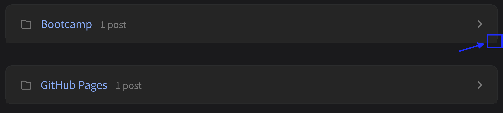

---
# **Feature and Testing**
## **Disqus 댓글 기능 활성화**
- 댓글 기능 활성화 방법 작성 예정(~10/26)

## **website tab image 테스트**
- chrisp theme guide에서 제시하는 favicon 이미지 생성 시, `48x48`은 생성되나, `16x16`, `32x32` 이미지 미생성되어 테스트 수행
- favicon 48x48 이미지를 2개 복사하여 `favicon 16x16` 및 `favicon 32x32`로 설정하여 `favicons` 폴더에 있는 기존 이미지들 대체
- **결과** : 이미지 대체 되나, loading에 시간이 걸림.


{: width="500" }
_초기에는 위와 같이, 기존 Chrispy 테마의 이미지가 나타난다._

{: width="500" }
_대략 1분 뒤, 설정한 이미지가 나타나게 됨._

- `16x16`, `32x32` 파일 생성하여 대체 필요.

---
# **Notes**
## **author: Gumraze 미작동**

```
---
title: write title
author: Gumraze # 다음과 같이 작성하면 author가 보이지 않게 됨.
date: wirte date
---
```
- author를 지정하게 되면, 아래와 같이 작성자가 나타나지 않음.

{: width="300" height="300"}
_author 이름이 나타나지 않음._

## **Updated**
- date를 지정해두어도 update를 수행한 date가 나타남.

# **Problem**
- Category에서 펼치기 버튼이 작동하지 않는 문제 존재함.


- Category의 끝 부분의 라운딩에서 미세한 각이 보임.



